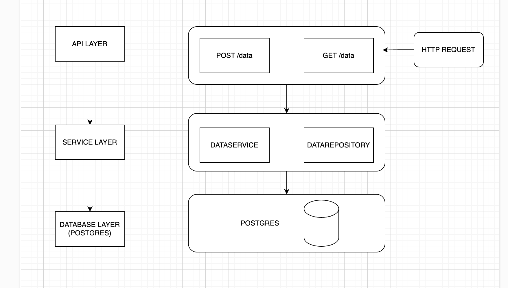
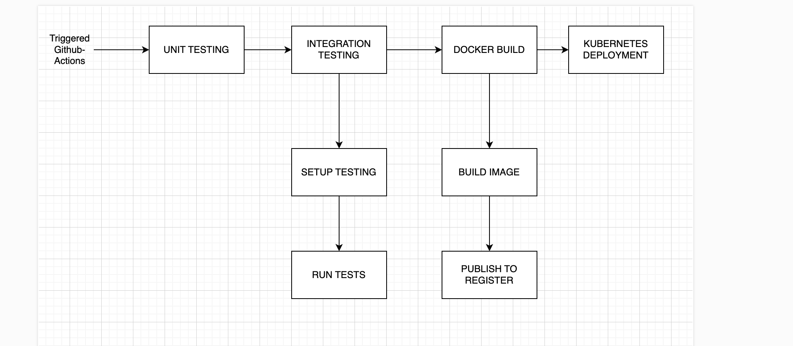

# Microservice Design Documentation

## High-Level Overview

In this document, we detail a microservice designed to handle large volumes of data, in order to ensure scalability and maintainability. It includes API endpoints for creating and reading data, deployed in a Docker container and Kubernetes for orchestration.

1. **Introduction**
2. **Requirements**
3. **Architecture Overview**
4. **Technology Stack**
5. **Containerization**
6. **Kubernetes Deployment**
7. **CI/CD Pipeline**
8. **Testing Strategy**

## 1. Introduction
The following two endpoints are available in the microservice:
- **POST /data**: Accept and validate JSON input before persisting it to a database.:
- **GET /data**: Retrieve and return stored data.

The microservice is designed to implement a REST architecture **stateless**, with a layered design for separation of responsibilities.

## 2. Requirements

### Requirements
- Accept JSON input via a REST API.
- Validate and persist data.
- Recover stored data.

## 3. Architecture Overview

### **Diagrama: Layered Architecture**


### Components
1. **API Layer**
  - Controllers that handle HTTP requests.
  - Performs validation of input data.
  - Formats responses.
2. **Service Layer**
  - Singletons that manage business logic.
  - Interface with the database layer for CRUD operations.
3. **Database Layer**
  - Persistent data storage.
  - Supports scalable read and write operations.

## 4. Technology Stack

### Justifications
- **Database:** PostgreSQL
  - Supports high scalability and ACID compliance.
  - Extensive support for indexing and query optimization.
- **Framework:** NestJS (Node.js)
  - Lightweight, non-blocking I/O.
  - Opinionated structure for maintainability.
- **Containerization:** Docker
  - Ensures portability and consistency.
- **Orchestration:** Kubernetes
  - Supports horizontal scalability and fault tolerance.

## 5. Containerization


### Dockerfile
```Dockerfile
FROM node:18

WORKDIR /app

COPY package*.json ./

RUN npm install

COPY . .

RUN npm run build

CMD [ "npm", "run", "start:dev" ]
```

### Explanation
The Dockerfile uses a lightweight Node.js base image to ensure performance and small size. It starts by setting up the working directory inside the container to maintain a clean and organized structure. Package-related files are copied first to take advantage of Docker’s caching mechanism, which allows dependencies to be installed efficiently using npm. The application source code is then copied into the container, followed by exposing the necessary port to allow external access. The application is then started using the NestJS production script, ensuring that it runs as expected in a production environment.


## 6. Kubernetes Deployment

### Deployment Strategy
- Horizontal Pod autoscaling based on CPU usage.
- PersistentVolumeClaims for database storage.

### YAML File Examples

#### Deployment
```yaml
apiVersion: apps/v1
kind: Deployment
metadata:
  name: data-service
spec:
  replicas: 3
  selector:
    matchLabels:
      app: data-service
  template:
    metadata:
      labels:
        app: data-service
    spec:
      containers:
      - name: data-service
        image: data-service:latest
        ports:
        - containerPort: 3000
```

#### Service
```yaml
apiVersion: v1
kind: Service
metadata:
  name: data-service
spec:
  type: LoadBalancer
  ports:
  - port: 80
    targetPort: 3000
  selector:
    app: data-service
```

## 7. CI/CD Pipeline

### Pipeline Diagram


### Steps
1. **Unit Tests:** Validate core functionality.
2. **Integration Tests:** Validate interactions between the API and the database.
3. **Docker Build:** Create and publish the container image.
4. **Kubernetes Deployment:** Deploy the latest image.

## 8. Testing Strategy

### Unit Testing
- Focus: Input validation, database interaction.
- Tools: Jest, mocha.
- Focus less on overall coverage and more on critical paths.
- Ensure that a good number of data validation scenarios are covered. Data consistency is extremely important for this service.

### Integration Testing
- Validate the API layer and database interactions.
- Have a script to populate the database with test data and then call the API endpoints, ensuring that the data is returned as expected.
- Ensure that the database is in a clean state before and after testing.

### Performance Testing
- Simulate high concurrency using tools like JMeter.

### Manual Testing
- For a minimal set of endpoints as proposed in the requirements, manual testing can be done to add an extra layer of validation.

### Getting Started
**Project Overview:** Microservice for data ingestion and retrieval with a focus on scalability.

**Setup:**
1. Clone the repository.
2. Run `docker-compose up`.
3. Access the API at `http://localhost:3000`.


